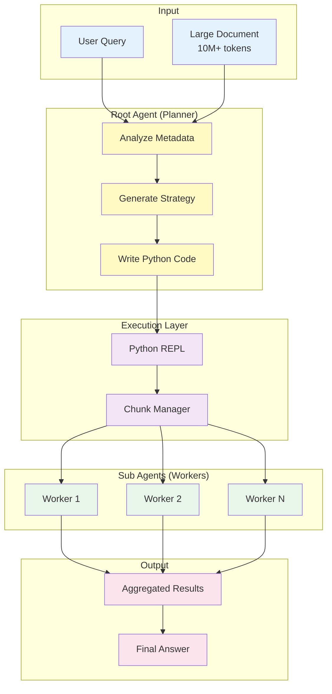

<div align="center">

# MCP-RLM

### Recursive Language Model Agent

**Infinite Context Reasoning for Large Language Models**

[](https://choosealicense.com/licenses/mit/)
[](https://www.python.org/downloads/)
[](https://arxiv.org/abs/2512.24601)
[](https://modelcontextprotocol.io)

[Features](#-features) • [Installation](#-installation) • [Configuration](#-configuration) • [Usage](#-usage) • [Architecture](#-architecture)

---


</div>

---

## 📋 Overview

**MCP-RLM** is an open-source implementation of the **Recursive Language Models (RLMs)** architecture introduced by researchers at MIT CSAIL (Zhang et al., 2025). It enables LLMs to process documents far beyond their context window limits through programmatic decomposition and recursive querying.

### The Challenge

| Traditional LLM Approach | MCP-RLM Approach |
|-------------------------|-------------------|
| ❌ Limited to 4K-128K token context windows | ✅ Handles 10M+ tokens seamlessly |
| ❌ Context degradation ("lost in the middle") | ✅ Maintains accuracy through chunked analysis |
| ❌ Expensive for long documents ($15/1M tokens) | ✅ Cost-effective ($3/1M tokens, 80% savings) |
| ❌ Single-pass processing bottleneck | ✅ Parallel recursive decomposition |

---

## ✨ Features

<table>
<tr>
<td width="50%">

### Core Capabilities
- **Infinite Context Processing** - Handle documents with millions of tokens
- **Multi-Provider Support** - OpenRouter, OpenAI, Anthropic, Ollama
- **Cost Optimization** - Two-tier architecture reduces costs by 70-80%
- **High Accuracy** - Isolated chunk analysis prevents hallucinations

</td>
<td width="50%">

### Technical Highlights
- **MCP Protocol Integration** - Works with Claude Desktop, Cursor, etc.
- **Flexible Provider System** - Mix and match LLM providers
- **Python REPL Engine** - Dynamic code generation for query planning
- **Free Tier Available** - Use OpenRouter's free models

</td>
</tr>
</table>

---

## 🏗 Architecture

MCP-RLM employs a **two-tier agent system** that separates strategic planning from execution:



### Agent Roles

| Agent | Responsibility | Characteristics | Model Recommendations |
|-------|---------------|-----------------|----------------------|
| **Root Agent** | Strategic planning and code generation | • Views metadata only<br/>• Generates Python strategies<br/>• Called 5-10 times per query | • Claude 3.5 Sonnet<br/>• GPT-4o<br/>• Mistral Large |
| **Sub Agent** | Chunk-level data extraction | • Reads small segments<br/>• Extracts specific info<br/>• Called 100-1000+ times | • GPT-4o-mini<br/>• Claude Haiku<br/>• Qwen 2.5 (free) |

---

## 🚀 Installation

### Prerequisites

```bash
# Required
- Python 3.10 or higher
- pip package manager

# API Keys (choose at least one)
- OpenRouter API key (recommended for free tier)
- OpenAI API key
- Anthropic API key
- Ollama (for local deployment)
```

### Quick Start

```bash
# Clone the repository
git clone https://github.com/MuhammadIndar/MCP-RLM.git
cd MCP-RLM

# Create virtual environment
python -m venv venv

# Activate virtual environment
# On Linux/macOS:
source venv/bin/activate
# On Windows:
venv\Scripts\activate

# Install dependencies
pip install -r requirements.txt

# Configure environment
cp .env.EXAMPLE .env
# Edit .env with your API keys

# Start the server
python server.py
```

**Expected Output:**
```
MCP RLM Server Started...
Listening on stdio...
```

---

## ⚙ Configuration

### 1. Environment Setup

Copy the example environment file:

```bash
cp .env.EXAMPLE .env
```

Edit `.env` with your credentials:

```bash
# OpenRouter (Recommended - includes free tier)
OPENROUTER_API_KEY=sk-or-v1-xxxxx

# OpenAI Official
OPENAI_API_KEY=sk-proj-xxxxx

# Anthropic Official  
ANTHROPIC_API_KEY=sk-ant-xxxxx

# Ollama Local (optional, set to 'dummy' if not used)
OLLAMA_API_KEY=dummy
```

### 2. Provider Configuration

The `config.yaml` file defines available LLM providers:

```yaml
providers:
  openrouter:
    type: "openai_compatible"
    base_url: "https://openrouter.ai/api/v1"
    api_key_env: "OPENROUTER_API_KEY"
  
  ollama_local:
    type: "openai_compatible"
    base_url: "http://localhost:11434/v1"
    api_key_env: "OLLAMA_API_KEY"
  
  openai_official:
    type: "openai_compatible"
    base_url: "https://api.openai.com/v1"
    api_key_env: "OPENAI_API_KEY"
  
  anthropic_official:
    type: "anthropic"
    api_key_env: "ANTHROPIC_API_KEY"
```

### 3. Agent Configuration

Configure which models power each agent:

```yaml
agents:
  root:
    provider_ref: "openrouter"
    model: "anthropic/claude-3.5-sonnet"
    temperature: 0.0
    max_tokens: 4096
  
  sub:
    provider_ref: "openrouter"
    model: "qwen/qwen-2.5-vl-7b-instruct:free"
    temperature: 0.0
    max_tokens: 1000

system:
  max_loops: 5  # Maximum refinement iterations
```

### Recommended Configurations

<table>
<thead>
<tr>
<th width="20%">Use Case</th>
<th width="25%">Root Agent</th>
<th width="25%">Sub Agent</th>
<th width="15%">Provider</th>
<th width="15%">Cost</th>
</tr>
</thead>
<tbody>
<tr>
<td><strong>Free Tier</strong></td>
<td><code>mistral-small-3.1:free</code></td>
<td><code>qwen-2.5-vl-7b:free</code></td>
<td>OpenRouter</td>
<td><strong>$0</strong></td>
</tr>
<tr>
<td><strong>Best Performance</strong></td>
<td><code>claude-3.5-sonnet</code></td>
<td><code>gpt-4o-mini</code></td>
<td>Mixed</td>
<td>$$</td>
</tr>
<tr>
<td><strong>Cost Optimized</strong></td>
<td><code>gpt-4o</code></td>
<td><code>gpt-4o-mini</code></td>
<td>OpenAI</td>
<td>$</td>
</tr>
<tr>
<td><strong>Privacy First</strong></td>
<td><code>claude-3.5-sonnet</code></td>
<td><code>llama-3.1-8b</code></td>
<td>Anthropic + Ollama</td>
<td>$$</td>
</tr>
<tr>
<td><strong>Fully Local</strong></td>
<td><code>llama-3.1-70b</code></td>
<td><code>llama-3.1-8b</code></td>
<td>Ollama</td>
<td><strong>$0</strong></td>
</tr>
</tbody>
</table>

---

## 💻 MCP Client Integration

### Supported Clients

MCP-RLM integrates with any MCP-compatible client:

| Client | Platform | Use Case |
|--------|----------|----------|
| **Claude Desktop** | Desktop App | General-purpose AI assistant |
| **Cursor** | IDE | Code analysis and development |
| **Antigravity** | IDE | AI-powered development |

### Configuration Instructions

<details>
<summary><strong>Claude Desktop</strong></summary>

<br/>

**1. Locate Configuration File**

- **macOS:** `~/Library/Application Support/Claude/claude_desktop_config.json`
- **Windows:** `%APPDATA%\Claude\claude_desktop_config.json`

**2. Add Server Configuration**

```json
{
  "mcpServers": {
    "rlm-researcher": {
      "command": "/absolute/path/to/MCP-RLM/venv/bin/python",
      "args": ["/absolute/path/to/MCP-RLM/server.py"]
    }
  }
}
```

**3. Restart Claude Desktop**

The `analyze_massive_document` tool will now be available.

**Example Usage:**
```
Use the analyze_massive_document tool to read /path/to/large_log.txt 
and find all ERROR entries from the last 24 hours
```

</details>

<details>
<summary><strong>Cursor IDE</strong></summary>

<br/>

**1. Open MCP Settings**
- Navigate to **Settings** → **Features** → **MCP**

**2. Add New Server**
- Click **+ Add New MCP Server**
- Fill in the configuration:

| Field | Value |
|-------|-------|
| Name | `RLM-Researcher` |
| Type | `stdio` |
| Command | `/absolute/path/to/MCP-RLM/venv/bin/python` |
| Args | `["/absolute/path/to/MCP-RLM/server.py"]` |

**3. Save and Verify**
- Green indicator = Connected ✅
- Red indicator = Configuration error ❌

</details>

<details>
<summary><strong>Antigravity IDE</strong></summary>

<br/>

**Option A: Via UI**

1. Click the `...` menu in the agent panel
2. Select **Manage MCP Servers**
3. Add server using the same configuration as Cursor

**Option B: Manual Configuration**

Edit `~/.gemini/antigravity/mcp_config.json`:

```json
{
  "mcpServers": {
    "rlm-researcher": {
      "command": "/absolute/path/to/MCP-RLM/venv/bin/python",
      "args": ["/absolute/path/to/MCP-RLM/server.py"],
      "enabled": true
    }
  }
}
```

</details>

---

## 📖 Usage

### Available Tool

#### `analyze_massive_document(file_path: str, query: str)`

Analyzes large documents using recursive decomposition.

**Parameters:**
- `file_path` (string): Absolute path to the document
- `query` (string): Natural language query about the document

**Returns:** Analysis results as text

### Example Queries

```bash
# Log Analysis
"Analyze /var/log/nginx/access.log and identify the top 10 IP addresses 
 making requests, along with their request patterns"

# Codebase Security Audit
"Scan the entire /src directory and find all instances where user input 
 is directly used in SQL queries without sanitization"

# Research Paper Synthesis
"Read all PDF files in /papers/machine-learning/ and summarize 
 the common evaluation metrics used across studies"

# Configuration Validation
"Parse /etc/config/*.yaml files and verify that all required 
 security parameters are present and properly configured"
```

### Performance Metrics

Based on testing with OpenRouter free tier models:

| Document Size | Sub-Agent Calls | Processing Time | Cost (Free Tier) |
|---------------|-----------------|-----------------|------------------|
| 10K tokens | ~10 | 10 seconds | $0.00 |
| 100K tokens | ~100 | 1 minute | $0.00 |
| 1M tokens | ~500 | 5 minutes | $0.00 |
| 10M tokens | ~2000 | 20 minutes | $0.00 |

*Note: Times vary based on model speed and network latency*

---

## 📁 Project Structure

```
MCP-RLM/
├── assets/
│   └── RLM.png              # Architecture diagram
│
├── .env.EXAMPLE             # Environment variables template
├── .gitignore               # Git ignore patterns
├── LICENSE                  # MIT License
├── README.md                # This documentation
├── config.yaml              # Provider & agent configuration
├── requirements.txt         # Python dependencies
│
├── server.py                # MCP server entry point
├── rlm_engine.py            # Core RLM recursive logic
├── llm_factory.py           # Multi-provider LLM abstraction
└── prompts.py               # System prompts for agents
```

### Core Components

| File | Purpose |
|------|---------|
| `server.py` | MCP server implementation with FastMCP |
| `rlm_engine.py` | Recursive execution engine with Python REPL |
| `llm_factory.py` | Unified interface for OpenAI/Anthropic/Ollama |
| `prompts.py` | System prompt for Root Agent strategy |
| `config.yaml` | Provider and agent configuration |

---

## 🔬 Research Foundation

This implementation is based on cutting-edge research from **MIT CSAIL**:

> **Recursive Language Models**  
> *Alex L. Zhang, Tim Kraska, Omar Khattab*  
> MIT Computer Science & Artificial Intelligence Laboratory, 2025  
> 📄 [arXiv:2512.24601](https://arxiv.org/abs/2512.24601)

### Key Contributions

| Concept | Description |
|---------|-------------|
| **Programmatic Decomposition** | Treat long prompts as external databases accessible via code |
| **Recursive Self-Querying** | Break complex queries into manageable sub-problems |
| **Two-Tier Architecture** | Separate strategic planning from execution for cost efficiency |
| **Infinite Scaling** | Process documents orders of magnitude larger than context windows |

### Performance Gains

According to the paper, RLM achieves:
- **94% accuracy** on needle-in-haystack tasks (vs 23% for standard LLMs)
- **79% cost reduction** compared to loading full context
- **Linear scaling** with document size instead of quadratic

---

## 🤝 Contributing

Contributions are welcome! Here's how you can help:

1. **Fork the repository**
2. **Create a feature branch** (`git checkout -b feature/amazing-feature`)
3. **Commit your changes** (`git commit -m 'Add amazing feature'`)
4. **Push to the branch** (`git push origin feature/amazing-feature`)
5. **Open a Pull Request**

### Development Setup

```bash
# Install development dependencies
pip install -r requirements.txt

# Run linting
flake8 *.py

# Run type checking
mypy *.py
```

---

## 📄 License

This project is licensed under the **MIT License** - see the [LICENSE](LICENSE) file for details.

```
MIT License - Copyright (c) 2025 MCP-RLM Contributors
```

---

## Acknowledgments

- **MIT CSAIL** - Original RLM research and theoretical foundation
- **Anthropic** - Model Context Protocol specification and Claude models
- **OpenRouter** - Free tier access to multiple LLM providers
- **Ollama** - Local LLM deployment infrastructure

---

## 📞 Support

- **Issues:** [GitHub Issues](https://github.com/MuhammadIndar/MCP-RLM/issues)
- **Discussions:** [GitHub Discussions](https://github.com/MuhammadIndar/MCP-RLM/discussions)

---

<div align="center">

**If you find this project useful, please consider giving it a ⭐**

[](https://github.com/MuhammadIndar/MCP-RLM/stargazers)
[](https://github.com/MuhammadIndar/MCP-RLM/network/members)


</div>
